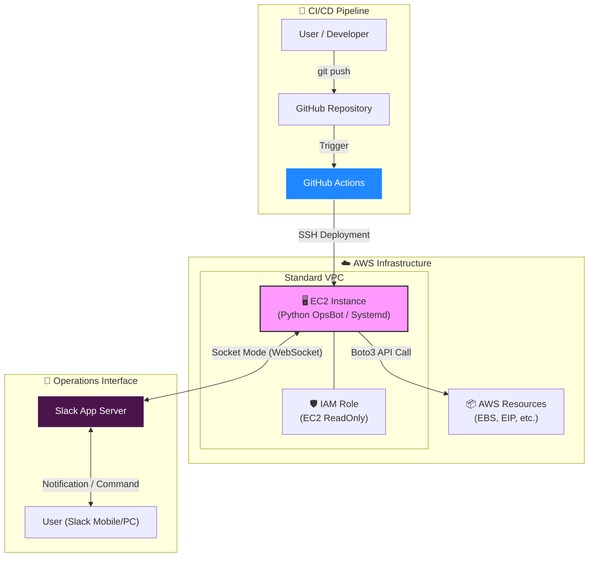

# 🤖 AWS Ops-Automation Portfolio
> **Terraform + Python + Slack + GitHub Actions**를 활용한 비용 최적화 및 ChatOps 자동화 프로젝트


## 🏗️ Architecture Diagram
아래 다이어그램은 본 프로젝트의 전체 자동화 흐름을 보여줍니다.


## 📜 Project Overview
1인 개발/운영 환경에서 **인프라 관리의 비효율을 제거**하기 위해 시작된 프로젝트입니다. 수동으로 콘솔에 접속하여 리소스를 점검하거나
배포하는 과정을 **100% 자동화**하였습니다.

### ✨ Key Features
1. **IaC**
   - Terraform을 사용하여 VPC, Subnet, EC2, IAM Role 등 전체 인프라를 코드로 정의하고 배포합니다.
2. **Cost Optimization Bot**
   - Boto3를 활용해 `Unused EBS Volumes`와 `Unassociated Elastic IPs`를 실시간으로 탐지합니다.
3. **ChatOps(Interactive Control)**
   - Slack Socket Mode를 통해 보안 그룹(Inbound) 개방 없이 안전하게 봇과 양방향 통신합니다.
   - 명령어: `@OpsBot 점검` -> 리포트 발행.
4. **Zero-Touch Deployment(CI/CD)**
   - GitHub Actions를 구축하여 코드 Push 시 EC2 서버에 자동 배포 및 서비스 재시작을 수행합니다.
5. **High Availability**
   - Linux Systemd 서비스 등록을 통해 프로세스 비정상 종료 시 자동 복구(Auto-Restart)를 보장합니다.
  
## 🛠️ Tech Stack & Tools
- **Infrastructure**: AWS(EC2, IAM, VPC), Terraform
- **Automation**: Python 3.9, Boto3 SDK
- **Interface**: Slack Bolt SDK(Socket Mode)
- **CI/CD**: GitHub Actions, Linux Shell Script
- **OS Management**: Amazon Linux 2023, Systemd

## 🚀 How to Run
**1. 전제조건**
- AWS Account & IAM User
- Terraform Installed
- Slack App Token(`xapp-...`) & Bot Token(`xoxb-...`)

**2. IaC 설정**
```bash
cd terraform
terraform init
terraform plan
terraform apply
```

**3. Application 설정 (On EC2)**
```bash
# Clone Repository
git clone [https://github.com/lee951109/devops-ops-automation-portfolio.git](https://github.com/lee951109/devops-ops-automation-portfolio.git)

# Install Dependencies
pip3 install -r requirements.txt

# Run Service (Systemd)
sudo systemctl start opsbot.service
```

## Ahthor
- **Name**: 이지현
- **Role**: DevOps Engineer / Full Stack Developer
- **Contact**: [GitHub Link](https://github.com/lee951109)
